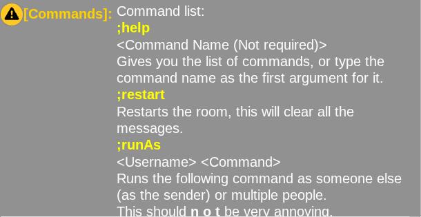

# `;help` Command

The `;help` command can show you a list of various commands.

The command will show an list of what commands you can do.



# Usage:

```messagecommand
;help
```

```messagecommand
;help <Command name>
```

# Examples

```messagecommand
;help restart
```

# Typing a command

You'll usually see something like:

```messagecommand
;popupMessage <Username> <Message>
Shows a popup to the user's browser saying the message provided.
```

To use the command you'll type in chat:

```messagecommand
;popupMessage gvbvdxx This is a message for gvbvdxx
```

Usually things in greater than and less than symbols (`<` and `>`) are required, and the command won't do anything or give an error without required arguments.

Each one of the things in the symbols is represented by a space, ones like for `<Message>` are always at the end and allow you to put spaces.

:::tip
When you see `<Username>`, you can use user selectors. Almost all message commands support them.

Type one of these to select one or more users in the room:

- `@all` - Selects everyone currently online, including you.
- `@others` - Selects everyone currently online, except you.
- `@self` or `@me` - Selects youself.

For example:

```messagecommand
;popupMessage @all This message is for everyone
```

:::
