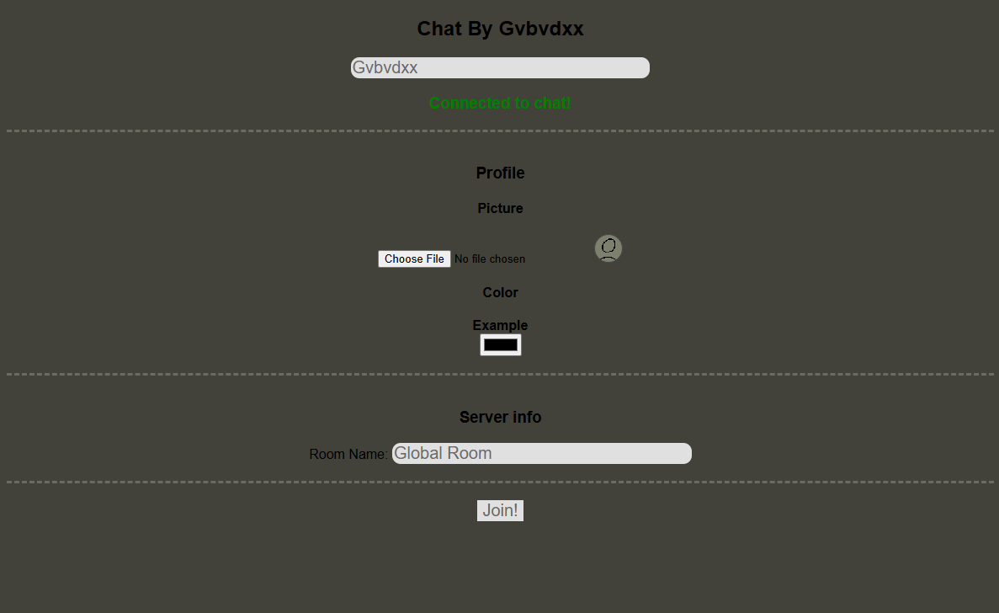

# Gvbvdxx Chat

:::info
This site no longer has a working server due to its significant security issues. However, you can experiment with a sandboxed version that uses a fake, in-browser server.
[View the safe version here](https://gvbvdxx-chat-safe.github.io/GvbvdxxChat)
:::

The first site I made that started my chat-app chain.

Gvbvdxx Chat was a foundational project for me. It served as my first real introduction to **WebSockets** and was a critical lesson in **client-side vs. server-side architecture**.

Started as an little site, from some tutorial on the internet. Then later figured out how to make a WebSocket server public (via [Glitch.com](https://glitch.com)), and then shared it on scratch.

The site's design was extremely simple:

- **Client-Based Logic:** Almost everything—user profiles, settings, and UI management—was handled entirely in the client's browser.
- **Simple Server:** The server was just a "message echoer." It didn't store data, process commands, or handle user state. It only received a message from one client and broadcasted it to every other client connected.

This setup also taught me my first hard lesson in **web security**. Because the client was responsible for rendering all messages, I used `innerHTML` to display the message content. A hacker quickly joined and abused this by sending messages like ``, executing arbitrary JavaScript on every other user's browser (a classic Cross-Site Scripting, or XSS, attack).

This project was the starting point that taught me what should (and shouldn't) be handled by a server to create a secure and functional application.

This same hacker later added his own admin command code, after that, I added my own code built-in to the site that does commands. Usually you can list them all through `;commands`.

## History & Context

I originally posted this site frequently on [Scratch](https://scratch.mit.edu). My intention wasn't to bypass moderation, but simply to provide a way for users to talk with each other in real-time, which Scratch didn't offer.

This project ultimately served as the base code for the more advanced [Macre's Chat](./macreschat.md).

Unfortunately, this site was also famously one of the key factors that led to me being blocked from the [Scratch](https://scratch.mit.edu) community. It wasn't my final block, but it was a major event leading to the Scratch Team losing trust in me.

## Screenshots

