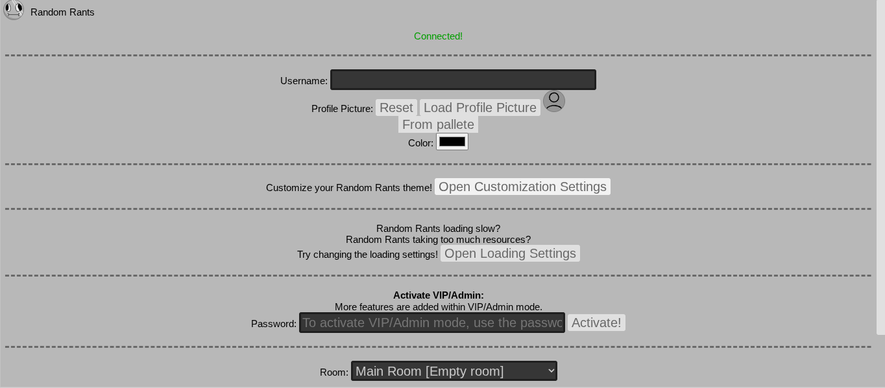
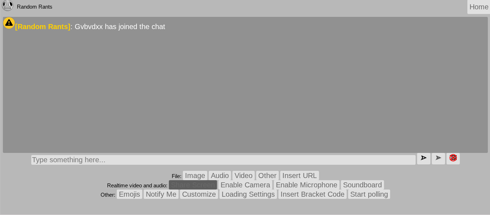
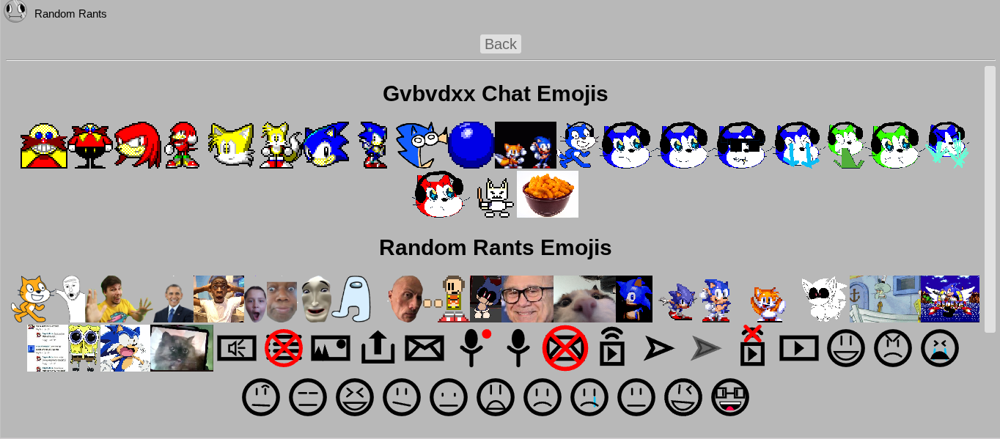

:::info
This site no longer has a working server due to its significant security issues. However, you can experiment with a sandboxed version that uses a fake, in-browser server.
[View the safe version here](https://gvbvdxx-chat-safe.github.io/RandomRants)

_**Some functions of the safe version don't work, and won't be fixed.**_
:::

**Random Rants** is the previous version of [**Random Rants +**](https://randomrants-plus.onrender.com/),

This site was a friend using another friend's chat site.

I met MOP3000 (the friend) in real life, and he wanted me to make a site _**exactly**_ like this site, with his ideas and features, shared a Google document with me, and worked on the site during class, and boom - the site was created, and more and more features kept being added.

Later we discussed the idea of making a new and more secure version, called [Random Rants +](https://randomrants-plus.onrender.com), and then that was created.

This site was blocked by my school (because of it's loud shared-soundboard) at the last day of school, but a few months later [Glitch](https://glitch.com) announched shutdown, and that was our service I used to get the site running.
Luckly ChatGPT had a good idea for the perfect replacement, called [Render](https://render.com).

I didn't want to leave anyone at risk, so I didn't want to upload the original **Random Rants**.

## Screenshots

